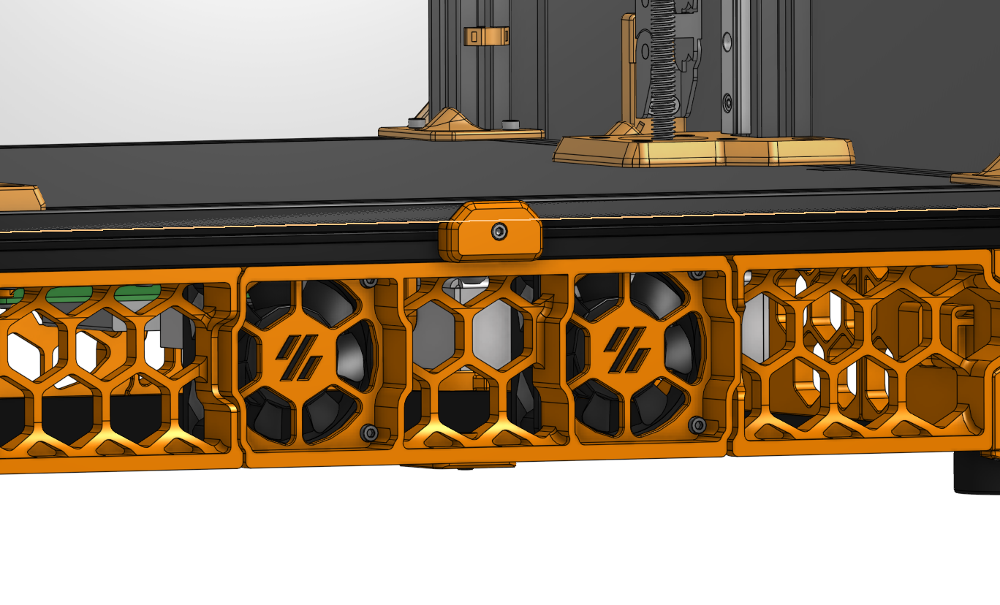
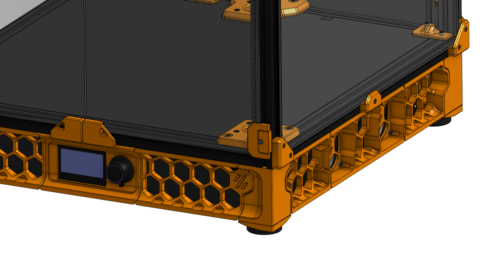

# inkognito fan mount

**for 300mm or larger sized printers only** (except you are really good at wiring)

This is a asthetic alternative to the varnilla Voron Trident Fan mount for the electronics bay. Fans visibility is not enforced, they are further in the electronics enclosure. As a side effect, you will need ~22mm more space. On 250mm sized printers you might not have that, but it entirely depends on your wiring skills. Make sure the wires are not interfering with the fan blades.

## instructions / assembly info

You don't need any additional hardware. But just in case you wanna know:
* 2x Fan 6020
* 8x heat set insert
* 8x M3x8 SHCS
* 1x M5x10 BHCS
* 1x 2020 Drop-In T-Nut M5

Print the body 2x (one for each side) and also print the spacer 2x (one for each fan). The spacer is that the fan is not scraping the body part.

Print with normal Voron settings.

Enclosure panel attaches as normal with the original attachment point and clip.