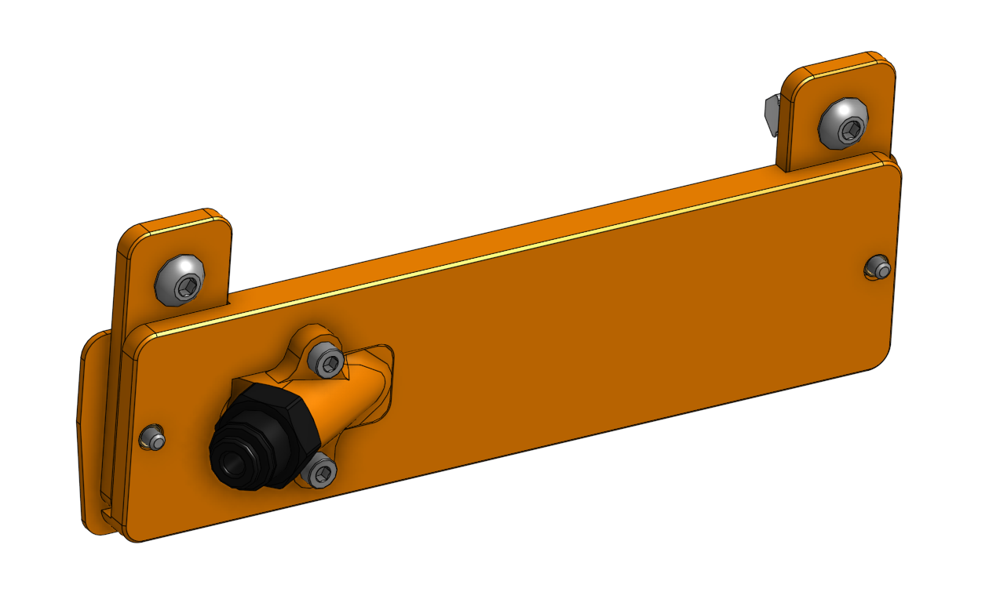
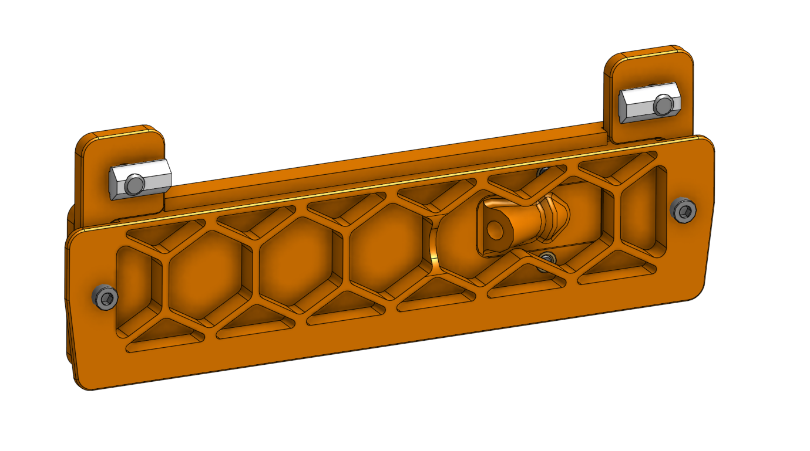

# PTFE tube side mount

This allows to mount the PTFE tube out in an angle. This ensures the Tube does get bent only minimally when the toolhead is at the back end of the printer.

## instructions / assembly info

The mounting brackets are from the original Trident CAD. They are named "Exhaust Mount".

you will need:
* 2x M3x8 SHCS
* 2x M3x12 SHCS (additionally, they are not in the original exhaust)
* 4x heat set insert
* 2x M5x10 BHCS
* 2x 2020 Drop-In T-Nut M5
* 1x BSP Bowden Connector

Print parts with normal Voron settings.

Print the grid or the back plate in accent color.