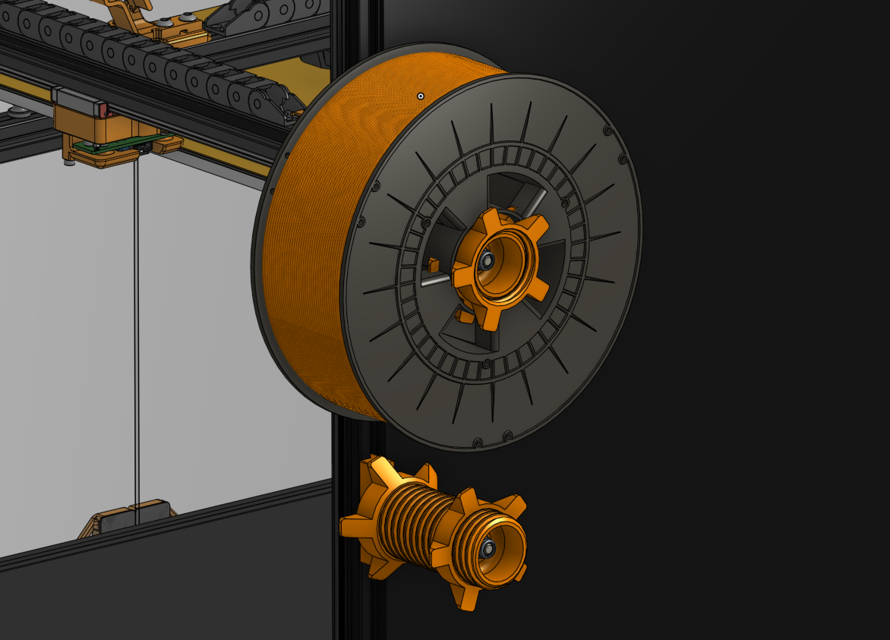
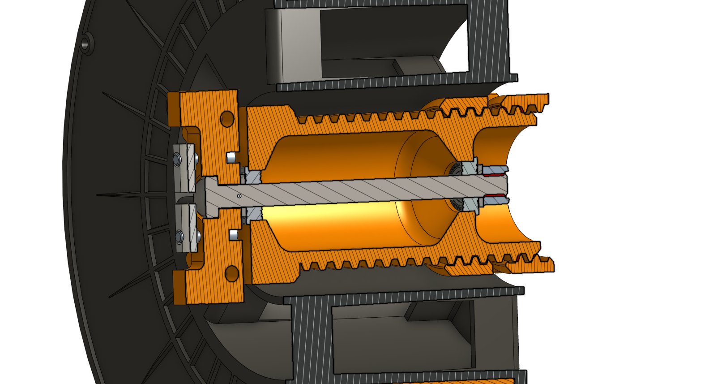

# screw spool holder

A screw type spool holder.

I have to give credit to [Calliano](https://www.thingiverse.com/thing:5543310) as I took inspiration from his design.

## instructions / assembly info

You will need (BOM):
* 2x Bearing F686 (Flanged, 6x13x5mm)
* 1x Bolt M6x90mm
* 1x M6 Self Locking Nut
* 2x Washer M6 narrow
* 2x 2020 Drop-In T-Nut M3 insert
* 2x M3x14 SHCS

Parts printed in normal Voron settings with ABS.

When assembling, do not thighten the Self Locking Nut fully. You will destroy the bearings.